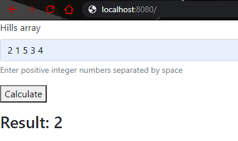
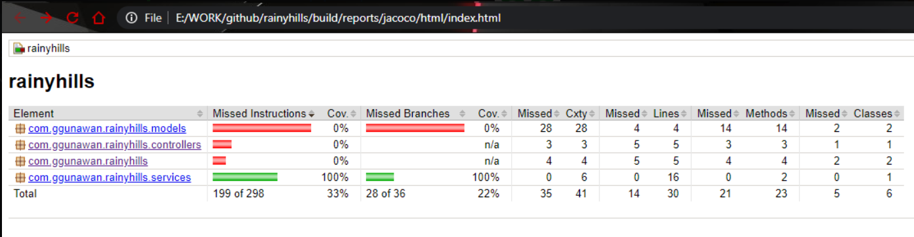
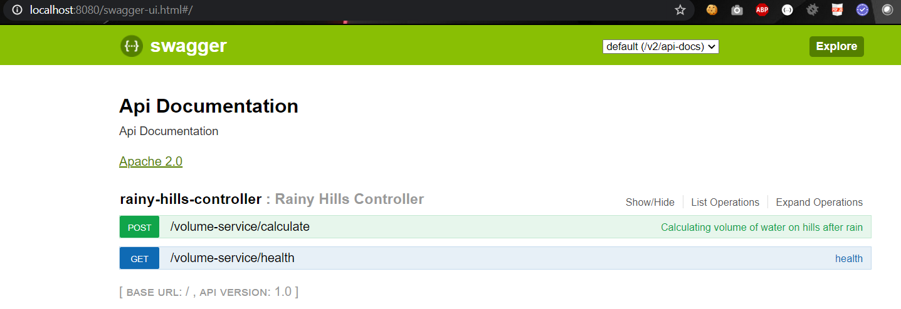

# Rainy Hills
This application provides endpoint which accepts arrays of integer and calculate the total volume of water remains after the rain.

## Build
Run the following command to build the project:

	./gradlew clean build

Start the app with following command:

	java -jar build/libs/rainyhills-0.0.1-SNAPSHOT.war
Access the application via browser
[http://localhost:8080/](http://localhost:8080/) .

### Application Structure
This application is split into frontend which is created using HTML, CSS (Bootstrap framework) & Javascript (jQuery) and backend part which is created using Java SpringBoot. The frontend will access the backend service via REST API call.
The backend part is split into service level ([VolumeCalculatorServiceImpl](./src/main/java/com/ggunawan/rainyhills/services/VolumeCalculatorServiceImpl.java)) and REST API level ([RainyHillsController](./src/main/java/com/ggunawan/rainyhills/controllers/RainyHillsController.java)).

### Test Coverage
This application is covered with unit test using JUnit and Mockito. It also has code coverage check using jacoco.

### API Documentation
API Documentation is created using swagger and can be accessed via this URL

	http://localhost:8080/swagger-ui.html

